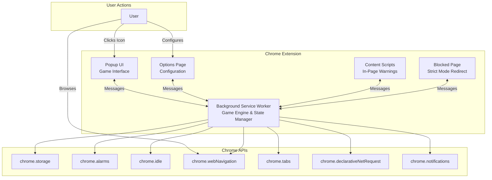
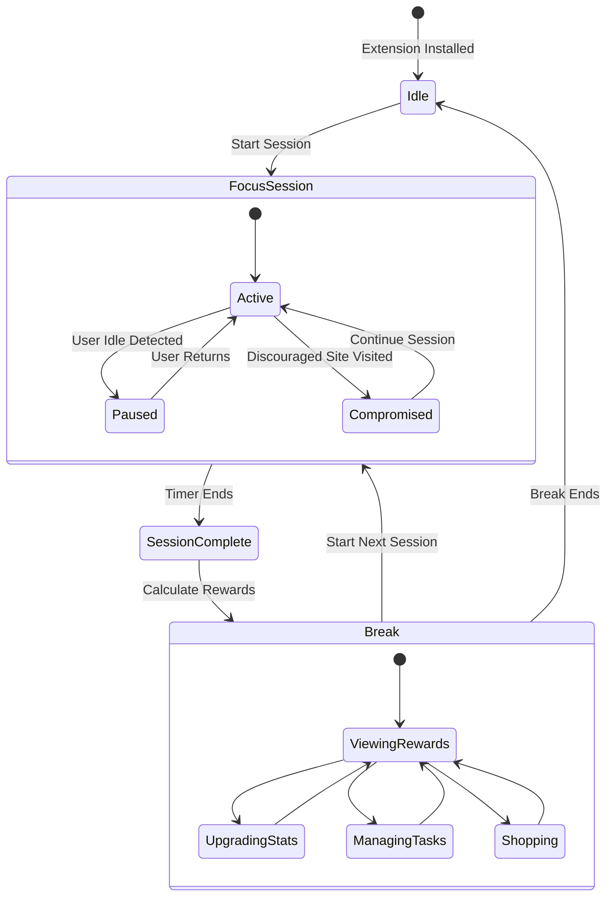

# Design Document

## Overview

Soul Shepherd is a Chrome Manifest v3 extension that gamifies productivity through a dopamine detox approach. The system consists of four main components: a Background Service Worker (game engine), a Popup UI (player interface), an Options Page (configuration), and optional Content Scripts (in-page warnings). The architecture follows a message-passing pattern where the background worker maintains authoritative game state, and UI components request state updates and send user actions.

The core game loop operates on a work-reward cycle: users start focus sessions (work phase) where the UI is minimal, complete real tasks, then receive rewards (Soul Insight XP and Soul Embers currency) during timed breaks where the full game UI is accessible. Progression occurs through a fixed campaign of Stubborn Soul bosses, while idle Content Soul collection provides passive currency generation.

## Architecture

### Component Diagram



### State Flow Diagram



### Message Passing Architecture

The extension uses Chrome's message passing for communication between components:

1. **Popup → Background**: User actions (start session, upgrade stat, purchase item)
2. **Background → Popup**: State updates (session progress, rewards calculated, break started)
3. **Options → Background**: Configuration changes (tasks updated, settings changed)
4. **Background → Options**: Current configuration for display
5. **Content Script → Background**: Discouraged site visited notification
6. **Background → Content Script**: Inject warning overlay command

All messages follow a typed structure:

```typescript
interface Message {
  type: string;
  payload?: any;
  requestId?: string; // For request-response pattern
}
```

## Components and Interfaces

### 1. Background Service Worker

**Responsibilities:**

- Maintain authoritative game state
- Manage focus session and break timers using chrome.alarms
- Calculate rewards and progression
- Monitor user navigation and idle state
- Handle idle Content Soul collection
- Persist state to chrome.storage
- Send notifications

**Key Modules:**

#### SessionManager

```typescript
interface SessionManager {
  startSession(duration: number, taskId: string): void;
  endSession(): SessionResult;
  pauseSession(): void;
  resumeSession(): void;
  getCurrentSession(): SessionState | null;
}

interface SessionState {
  startTime: number;
  duration: number;
  taskId: string;
  isActive: boolean;
  isPaused: boolean;
  isCompromised: boolean;
  idleTime: number;
  activeTime: number;
}

interface SessionResult {
  soulInsight: number;
  soulEmbers: number;
  bossProgress: number;
  wasCritical: boolean;
  wasCompromised: boolean;
  idleTime: number;
  activeTime: number;
}
```

#### RewardCalculator

```typescript
interface RewardCalculator {
  calculateRewards(session: SessionState, stats: PlayerStats): SessionResult;
  checkCritical(harmony: number): boolean;
  applyCompromisePenalty(baseReward: number): number;
}

// Formulas:
// Base Soul Insight = sessionDuration * 10 * (1 + spirit * 0.1)
// Base Soul Embers = sessionDuration * 2 * (1 + soulflow * 0.05)
// Critical multiplier = 1.5x to both rewards
// Compromise penalty = 0.7x to both rewards
// Boss damage = spirit * sessionDuration * 0.5
```

#### ProgressionManager

```typescript
interface ProgressionManager {
  damageBoss(amount: number): BossResult;
  getCurrentBoss(): StubbornSoul;
  unlockNextBoss(): void;
  addExperience(soulInsight: number): LevelResult;
  grantSkillPoints(amount: number): void;
}

interface BossResult {
  remainingResolve: number;
  wasDefeated: boolean;
  nextBoss?: StubbornSoul;
}

interface LevelResult {
  newLevel: number;
  leveledUp: boolean;
  skillPointsGranted: number;
}
```

#### IdleCollector

```typescript
interface IdleCollector {
  collectIdleSouls(): number;
  calculateIdleRate(soulflow: number): number;
  getTimeSinceLastCollection(): number;
}

// Formula:
// Idle rate = 1 soul per 5 minutes * (1 + soulflow * 0.1)
// Soul Embers per Content Soul = 5
```

#### NavigationMonitor

```typescript
interface NavigationMonitor {
  startMonitoring(): void;
  stopMonitoring(): void;
  checkUrl(url: string): SiteStatus;
}

enum SiteStatus {
  ALLOWED,
  DISCOURAGED,
  BLOCKED,
}
```

#### StateManager

```typescript
interface StateManager {
  loadState(): Promise<GameState>;
  saveState(state: GameState): Promise<void>;
  getState(): GameState;
  updateState(partial: Partial<GameState>): void;
}
```

**Chrome API Usage:**

- `chrome.alarms`: Create timers for session end, break end, idle collection
- `chrome.idle`: Detect user idle state (threshold: 120 seconds)
- `chrome.webNavigation.onCommitted`: Monitor page navigation
- `chrome.storage.local`: Persist game state
- `chrome.notifications`: Notify session/break completion
- `chrome.declarativeNetRequest`: Block sites in strict mode

### 2. Popup UI

**Responsibilities:**

- Display current game state
- Provide session start interface
- Show rewards after session completion
- Display full game UI during breaks
- Handle user interactions for upgrades and purchases

**View States:**

#### Idle View

- Display Soul Shepherd character
- Show current stats (Spirit, Harmony, Soulflow, Level)
- Show currency (Soul Insight progress, Soul Embers)
- Show current Stubborn Soul and progress
- Button: "Start Focus Session"
- Dropdown: Select task to work on
- Input: Session duration (pre-filled with default)

#### Focus Session View (Minimal)

- Large text: "Soul Shepherd is communing with a Stubborn Soul. Stay focused."
- Small text: Time remaining (optional, can be hidden for deeper focus)
- No other UI elements visible

#### Reward View (Post-Session)

- Animated reward reveal
- Soul Insight earned (with XP bar animation)
- Soul Embers earned
- Boss damage dealt and remaining Resolve
- Critical hit indicator (if applicable)
- Compromise warning (if applicable)
- Idle time vs active time breakdown
- Button: "Continue to Break"

#### Break View (Full Game UI)

- Soul Shepherd character (animated)
- Floating Content Souls (animated based on Soulflow)
- Stats panel with upgrade buttons
- Current Stubborn Soul card (backstory, progress bar)
- Shop panel (cosmetics)
- Statistics panel (total sessions, streak, total time)
- Break timer countdown
- Button: "Start Next Session"

**UI Framework:**

- Vanilla TypeScript with DOM manipulation
- CSS animations for Content Souls and rewards
- Responsive layout (popup is 400x600px)
- Theme system for cosmetic customization

**Message Handlers:**

```typescript
interface PopupMessageHandlers {
  onStateUpdate(state: GameState): void;
  onSessionStarted(): void;
  onSessionEnded(result: SessionResult): void;
  onBreakStarted(duration: number): void;
  onBreakEnded(): void;
  onBossDefeated(boss: StubbornSoul): void;
  onLevelUp(newLevel: number, skillPoints: number): void;
}
```

### 3. Options Page

**Responsibilities:**

- Task and goal management
- Session and break duration configuration
- Discouraged and blocked site management
- Strict mode toggle
- Animation and notification preferences
- Display current game statistics

**Sections:**

#### Task Management

- Tree view of Goals → Tasks → Subtasks
- CRUD operations for each level
- Drag-and-drop reordering
- Mark tasks as complete
- Task metadata: name, description, estimated duration

#### Session Configuration

- Default session duration (5-120 minutes, default: 25)
- Default break duration (1-30 minutes, default: 5)
- Auto-start next session toggle
- Idle detection sensitivity

#### Distraction Management

- Discouraged sites list (soft warnings)
  - Add/remove domains
  - Test URL against list
- Blocked sites list (strict mode)
  - Add/remove domains
  - Requires strict mode enabled
- Strict mode toggle with warning

#### Preferences

- Enable/disable animations
- Enable/disable notifications
- Sound volume
- Theme selection (if unlocked)

#### Statistics Dashboard

- Total focus time
- Total sessions completed
- Current streak
- Longest streak
- Bosses defeated
- Current level and stats

**Data Persistence:**
All options are saved to `chrome.storage.local` immediately on change.

### 4. Content Scripts

**Responsibilities:**

- Inject warning overlays on discouraged sites
- Communicate site visits to background worker

**Injection Strategy:**

- Injected on all HTTP/HTTPS pages via manifest
- Check with background if current site is discouraged
- Only display overlay during active focus sessions

**Overlay Design:**

- Semi-transparent banner at top of page
- Text: "The Soul Shepherd senses this realm drains your Spirit. Return to your task."
- Subtle fade-in animation
- Does not block page interaction
- Dismissible but reappears on navigation

**Message Flow:**

1. Content script loads on page
2. Sends URL to background worker
3. Background responds with site status
4. If discouraged and session active, inject overlay
5. Notify background of visit (for compromise tracking)

### 5. Blocked Page

**Responsibilities:**

- Display when strict mode blocks a site
- Provide emergency session end option

**Design:**

- Full-page overlay with Soul Shepherd character
- Large text: "This realm is sealed while your Soul Shepherd works."
- Smaller text: Current Stubborn Soul name and remaining time
- Button: "End Session Early (Penalty Applied)"
  - Reduces rewards by 50%
  - Marks session as compromised
- No way to access blocked site without ending session

## Data Models

### GameState

```typescript
interface GameState {
  player: PlayerState;
  session: SessionState | null;
  break: BreakState | null;
  progression: ProgressionState;
  tasks: TaskState;
  settings: SettingsState;
  statistics: StatisticsState;
}
```

### PlayerState

```typescript
interface PlayerState {
  level: number;
  soulInsight: number; // Total accumulated
  soulInsightToNextLevel: number;
  soulEmbers: number;
  stats: PlayerStats;
  skillPoints: number;
  cosmetics: CosmeticState;
}

interface PlayerStats {
  spirit: number; // Base: 1
  harmony: number; // Base: 0.05 (5% crit chance)
  soulflow: number; // Base: 1
}

interface CosmeticState {
  ownedThemes: string[];
  ownedSprites: string[];
  activeTheme: string;
  activeSprite: string;
}
```

### ProgressionState

```typescript
interface ProgressionState {
  currentBossIndex: number;
  currentBossResolve: number;
  defeatedBosses: number[];
  idleState: IdleState;
}

interface IdleState {
  lastCollectionTime: number;
  accumulatedSouls: number;
}

interface StubbornSoul {
  id: number;
  name: string;
  backstory: string;
  initialResolve: number;
  sprite: string;
  unlockLevel: number;
}

// Boss catalog (fixed data, not in state):
const STUBBORN_SOULS: StubbornSoul[] = [
  {
    id: 0,
    name: "The Restless Athlete",
    backstory:
      "A runner who never crossed the finish line they dreamed of. They cling to the track, running endless laps.",
    initialResolve: 100,
    sprite: "athlete.png",
    unlockLevel: 1,
  },
  {
    id: 1,
    name: "The Unfinished Scholar",
    backstory:
      "A researcher who died before publishing their life's work. They haunt the library, searching for one more source.",
    initialResolve: 200,
    sprite: "scholar.png",
    unlockLevel: 3,
  },
  {
    id: 2,
    name: "The Regretful Parent",
    backstory:
      "A parent who missed their child's milestones. They linger at the playground, watching families.",
    initialResolve: 350,
    sprite: "parent.png",
    unlockLevel: 5,
  },
  // ... more bosses
];
```

### TaskState

```typescript
interface TaskState {
  goals: Goal[];
  nextId: number;
}

interface Goal {
  id: string;
  name: string;
  description: string;
  tasks: Task[];
  createdAt: number;
}

interface Task {
  id: string;
  goalId: string;
  name: string;
  description: string;
  subtasks: Subtask[];
  isComplete: boolean;
  createdAt: number;
}

interface Subtask {
  id: string;
  taskId: string;
  name: string;
  estimatedDuration: number; // minutes
  isComplete: boolean;
  createdAt: number;
}
```

### SettingsState

```typescript
interface SettingsState {
  defaultSessionDuration: number; // minutes, default: 25
  defaultBreakDuration: number; // minutes, default: 5
  autoStartNextSession: boolean; // default: false
  idleThreshold: number; // seconds, default: 120
  strictMode: boolean; // default: false
  discouragedSites: string[]; // domains
  blockedSites: string[]; // domains
  animationsEnabled: boolean; // default: true
  notificationsEnabled: boolean; // default: true
  soundVolume: number; // 0-1, default: 0.5
}
```

### StatisticsState

```typescript
interface StatisticsState {
  totalSessions: number;
  totalFocusTime: number; // minutes
  currentStreak: number;
  longestStreak: number;
  lastSessionDate: string; // ISO date
  bossesDefeated: number;
  totalSoulInsightEarned: number;
  totalSoulEmbersEarned: number;
  totalIdleSoulsCollected: number;
}
```

## Error Handling

### Storage Errors

- **Problem**: chrome.storage operations fail
- **Handling**:
  - Retry with exponential backoff (3 attempts)
  - If all fail, show user notification
  - Maintain in-memory state as fallback
  - Log error to console for debugging

### Timer Errors

- **Problem**: chrome.alarms fail to fire or fire late
- **Handling**:
  - On popup open, check if session/break should have ended
  - Calculate missed time and apply retroactively
  - Notify user of time discrepancy
  - Adjust rewards based on actual elapsed time

### Navigation Monitoring Errors

- **Problem**: chrome.webNavigation events missed
- **Handling**:
  - Accept that some visits may not be tracked
  - Don't penalize user for missed events
  - Log warning but continue session normally

### Idle Detection Errors

- **Problem**: chrome.idle API unavailable or inaccurate
- **Handling**:
  - Gracefully degrade to no idle detection
  - Warn user in options that idle detection is disabled
  - Continue with normal session tracking

### State Corruption

- **Problem**: Loaded state is invalid or corrupted
- **Handling**:
  - Validate state schema on load
  - If invalid, attempt to migrate or repair
  - If unrepairable, reset to default state
  - Notify user of data loss
  - Backup old state to separate storage key

### Message Passing Failures

- **Problem**: Messages between components fail to deliver
- **Handling**:
  - Implement request-response pattern with timeouts
  - Retry failed messages (2 attempts)
  - Show user error if critical message fails
  - Log all message failures for debugging

## Testing Strategy

### Unit Testing

- **Framework**: Jest with @types/chrome mocks
- **Coverage**:
  - RewardCalculator: Test all formulas with various inputs
  - ProgressionManager: Test level-up thresholds and boss progression
  - IdleCollector: Test time-based calculations
  - NavigationMonitor: Test URL matching logic
  - StateManager: Test state validation and migration

### Integration Testing

- **Framework**: Puppeteer with Chrome extension support
- **Scenarios**:
  - Complete focus session flow (start → work → rewards → break)
  - Idle detection during session
  - Discouraged site visit during session
  - Strict mode blocking
  - Boss defeat and unlock next boss
  - Level up and skill point allocation
  - Stat upgrade purchase
  - Task CRUD operations in options

### Manual Testing Checklist

- [ ] Install extension and verify initial state
- [ ] Start session and verify UI switches to minimal view
- [ ] Complete session and verify rewards calculation
- [ ] Verify break timer and full UI access
- [ ] Test idle detection by stepping away
- [ ] Visit discouraged site during session
- [ ] Enable strict mode and verify blocking
- [ ] Create/edit/delete goals, tasks, subtasks
- [ ] Upgrade stats and verify cost calculation
- [ ] Defeat boss and verify next boss unlocks
- [ ] Level up and allocate skill points
- [ ] Purchase cosmetic and verify application
- [ ] Test streak tracking across multiple days
- [ ] Verify idle collection over time
- [ ] Test all notification scenarios
- [ ] Verify state persistence across browser restarts

### Performance Testing

- **Metrics**:
  - Popup load time < 100ms
  - Background worker memory usage < 50MB
  - Storage operations < 50ms
  - Animation frame rate > 30fps
- **Tools**:
  - Chrome DevTools Performance profiler
  - Memory profiler for leak detection
  - Network tab for storage operation timing

### Accessibility Testing

- **Requirements**:
  - All interactive elements keyboard accessible
  - Proper ARIA labels on buttons and inputs
  - Sufficient color contrast (WCAG AA)
  - Screen reader compatible
  - Focus indicators visible
- **Tools**:
  - Chrome Lighthouse accessibility audit
  - axe DevTools
  - Manual keyboard navigation testing
  - NVDA/JAWS screen reader testing

## Implementation Phases

### Phase 1: Core Infrastructure

- Set up manifest.json with all permissions
- Implement Background Service Worker skeleton
- Implement StateManager with storage persistence
- Create basic Popup UI shell
- Establish message passing between components
- _Requirements: All foundational requirements_

### Phase 2: Session Management

- Implement SessionManager with timer logic
- Implement RewardCalculator with formulas
- Create focus session UI (minimal view)
- Create reward display UI
- Integrate chrome.alarms for timers
- _Requirements: 1.1, 1.2, 1.3, 1.4, 1.5, 2.1, 2.2, 2.3, 2.4, 2.5_

### Phase 3: Progression System

- Implement ProgressionManager
- Create Stubborn Soul data catalog
- Implement boss damage and defeat logic
- Implement level-up and skill point system
- Create boss display UI in popup
- _Requirements: 3.1, 3.2, 3.3, 3.4, 3.5, 9.1, 9.2, 9.3, 9.4, 9.5_

### Phase 4: Idle Collection

- Implement IdleCollector
- Create idle collection alarm
- Implement Content Soul animations
- Add idle collection display to popup
- _Requirements: 4.1, 4.2, 4.3, 4.4, 4.5, 13.1, 13.2, 13.3, 13.4, 13.5_

### Phase 5: Task Management

- Create Options Page HTML/CSS
- Implement task CRUD operations
- Create task tree UI
- Integrate task selection in popup
- Persist tasks to storage
- _Requirements: 5.1, 5.2, 5.3, 5.4, 5.5_

### Phase 6: Distraction Handling

- Implement NavigationMonitor
- Create discouraged sites configuration UI
- Implement Content Scripts for warnings
- Add compromise tracking to sessions
- _Requirements: 6.1, 6.2, 6.3, 6.4, 6.5_

### Phase 7: Strict Mode

- Implement declarativeNetRequest rules
- Create blocked page HTML
- Add strict mode toggle to options
- Implement emergency session end
- _Requirements: 7.1, 7.2, 7.3, 7.4, 7.5_

### Phase 8: Stats and Upgrades

- Implement stat upgrade system
- Create upgrade UI in popup
- Implement cost scaling formula
- Add stat display to all relevant views
- _Requirements: 8.1, 8.2, 8.3, 8.4, 8.5_

### Phase 9: Break System

- Implement break timer
- Create break UI with full game access
- Add break end notification
- Implement auto-start option
- _Requirements: 10.1, 10.2, 10.3, 10.4, 10.5_

### Phase 10: Configuration

- Complete Options Page settings sections
- Implement all validation logic
- Add default value pre-population
- Create settings persistence
- _Requirements: 11.1, 11.2, 11.3, 11.4, 11.5_

### Phase 11: Idle Detection

- Integrate chrome.idle API
- Implement session pause/resume
- Add idle time tracking
- Display idle breakdown in rewards
- _Requirements: 12.1, 12.2, 12.3, 12.4, 12.5_

### Phase 12: Statistics

- Implement statistics tracking
- Create statistics display UI
- Implement streak logic
- Add statistics to options page
- _Requirements: 14.1, 14.2, 14.3, 14.4, 14.5_

### Phase 13: Cosmetics

- Create cosmetic catalog
- Implement shop UI
- Add cosmetic purchase logic
- Implement theme application
- Sync cosmetics across devices
- _Requirements: 15.1, 15.2, 15.3, 15.4, 15.5_

### Phase 14: Polish and Testing

- Add all animations and transitions
- Implement sound effects
- Complete accessibility features
- Perform full testing suite
- Fix bugs and optimize performance
